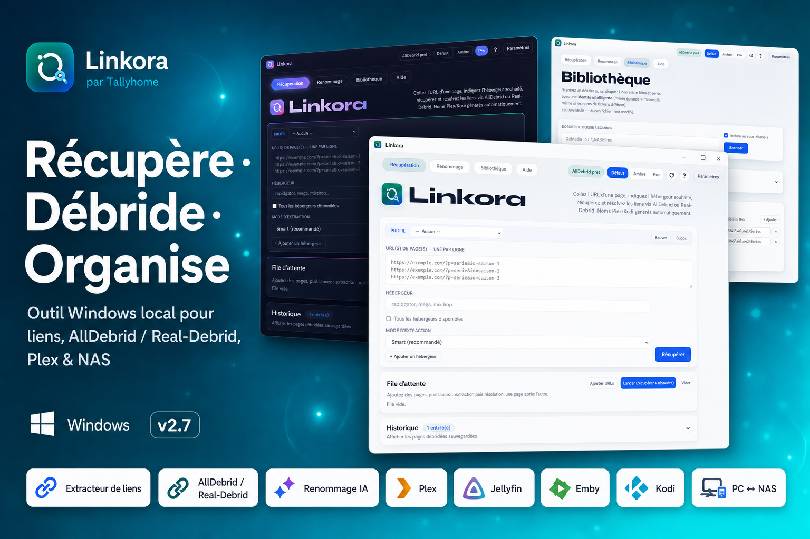

# Linkora

<p align="center">
  
</p>

<p align="center">
  <strong>Récupération de liens · Débridage · Renommage intelligent</strong><br>
  Outil local pour extraire, résoudre (AllDebrid / Real-Debrid) et renommer vos fichiers pour Plex, Kodi ou Jellyfin.
</p>

<p align="center">
  <a href="https://github.com/tallyhome/Linkora/releases/latest"></a>
  <a href="https://github.com/tallyhome/Linkora/releases/latest"></a>
  <a href="LICENSE"></a>
</p>

<p align="center">
  <a href="https://github.com/tallyhome/Linkora/releases/latest/download/Linkora-Setup.exe"></a>
  &nbsp;
  <a href="https://github.com/tallyhome/Linkora/releases/latest/download/Linkora-windows.zip"></a>
</p>

<p align="center">
  <a href="https://github.com/tallyhome/Linkora/releases/latest">Toutes les versions →</a>
  · © 2026 Tallyhome · MIT
</p>

<p align="center">
  
</p>

---

## Télécharger (Windows)

| | Fichier | Pour qui ? |
|---|--------|--------|
| **Installateur** (recommandé) | [**Linkora-Setup.exe**](https://github.com/tallyhome/Linkora/releases/latest/download/Linkora-Setup.exe) | Installation classique : menu Démarrer, raccourci Bureau, désinstallation |
| **Portable** | [**Linkora-windows.zip**](https://github.com/tallyhome/Linkora/releases/latest/download/Linkora-windows.zip) | Sans install : dézipper → lancer `Linkora.exe` (clé USB, etc.) |

> Les liens ci-dessus pointent toujours vers la **dernière release**. Page complète : [Releases](https://github.com/tallyhome/Linkora/releases/latest).

### Démarrage rapide

1. Lancez **Setup** (ou `Linkora.exe` en portable)
2. **Paramètres** → collez votre clé API AllDebrid ou Real-Debrid → Tester → Enregistrer
3. Collez une ou plusieurs URLs, indiquez l’hébergeur (`rapidgator`, etc.)
4. **Récupérer** → **Résoudre** → exportez / copiez / JDownloader

Prérequis : compte **AllDebrid** ou **Real-Debrid** (clé API).  
Windows peut afficher un avertissement SmartScreen (exe non signé) — voir [docs/CODE_SIGNING.md](docs/CODE_SIGNING.md).

## Fonctionnalités

- **Extraction multi-pages** — collez plusieurs URLs, un bloc de résultats par page
- **Débridage** — AllDebrid / Real-Debrid (résolution parallèle + retries)
- **Historique** — une entrée par page, panneau repliable
- **Exports** — CSV, HTML, PDF, format JDownloader (`URL | Nom suggéré`)
- **Renommage intelligent** — séries `S03E01`, films `Titre (2024)`, anime… pour Plex / Kodi / Jellyfin
- **Bibliothèque** — scan, diff PC ↔ NAS, affiches & manques TMDB (séries + suites de films)
- **Multi-hébergeurs** — jusqu’à 6 hébergeurs + fallback si lien mort
- **Auto-update** — vérifie GitHub au démarrage et applique les mises à jour automatiquement

## Marque

| Asset | Aperçu |
|--------|--------|
| Icône / logo |  |
| Logo SVG |  · [`logo.svg`](static/img/logo.svg) |
| Promo marketplace |  |
| Promo social |  |
| Promo Pro (sombre) |  |

> GitHub n’affiche pas les fichiers `.svg` dans le README (restriction de sécurité) : l’aperçu ci-dessus utilise le PNG ; le SVG reste téléchargeable via le lien.

Fichiers : `docs/logo.png`, `static/img/logo.svg`, `static/img/logo.png`, `docs/promo/…`

## macOS / Linux (depuis les sources)

Pas d’installateur desktop pour le moment : lancez l’interface web locale.

```bash
git clone https://github.com/tallyhome/Linkora.git
cd Linkora
python3 -m venv .venv
source .venv/bin/activate
pip install -r requirements.txt
python app.py
```

Ouvrez [http://127.0.0.1:5000](http://127.0.0.1:5000).  
Python **3.10+** requis.

### CLI (headless)

```bash
python cli.py version
python cli.py extract --url "https://..." --host rapidgator --resolve
python cli.py rename --folder "/chemin/dossier" --dry-run
```

## Documentation

- [Changelog](CHANGELOG.md)
- [TODO](TODO.md)
- [Roadmap](docs/ROADMAP.md)
- [Site de MAJ dédié](docs/UPDATE_SITE.md)
- [Signature Authenticode](docs/CODE_SIGNING.md)

## Auto-update

Au démarrage, Linkora interroge les [releases GitHub](https://github.com/tallyhome/Linkora/releases).

- Si une version plus récente existe → elle est **appliquée automatiquement** (si l’option est active)
- Les données locales (`data/`, clés API, historique) sont **conservées**
- Un bandeau indique qu’un **redémarrage** est recommandé après mise à jour

Vous pouvez aussi vérifier / forcer une MAJ depuis **Paramètres**.  
Désactiver : Paramètres → décocher « Mise à jour automatique ».

## Build Windows (développeurs)

```powershell
winget install JRSoftware.InnoSetup   # une fois, pour l’installateur
.\tools\build_windows.ps1
```

Sortie : `dist/Linkora/`, zip portable, et `Linkora-Setup-vX.Y.Z.exe`.  
Signature / antivirus : [docs/CODE_SIGNING.md](docs/CODE_SIGNING.md) · [Politique de signature](CODE_SIGNING_POLICY.md) · [SignPath](docs/SIGNPATH.md).

## Structure

```
Linkora/
├── desktop.py          # Lanceur fenêtre Windows
├── app.py              # Serveur Flask
├── scraper.py          # Extraction des liens
├── debrid.py           # Clients AllDebrid / Real-Debrid
├── smart_naming.py     # Noms Plex / Kodi / Jellyfin
├── updater.py          # Vérification & MAJ GitHub
├── settings.py         # Réglages locaux
├── storage.py          # Historique SQLite
├── static/             # CSS, JS, logos
├── templates/          # Interface
└── data/               # Local (gitignored) — clés & historique
```

## Sécurité

- Les clés API restent **uniquement sur votre machine** (`data/settings.json`, non versionné)
- Linkora est un outil **local** : ne l’exposez pas sur Internet sans protection
- This program will not transfer any information to other networked systems unless specifically requested by the user or the person installing or operating it
- **Code signing policy** : [CODE_SIGNING_POLICY.md](CODE_SIGNING_POLICY.md)

## Licence

[MIT](LICENSE) — © 2026 Tallyhome  

Voir aussi les conditions d’utilisation d’AllDebrid, Real-Debrid et des sites sources.
